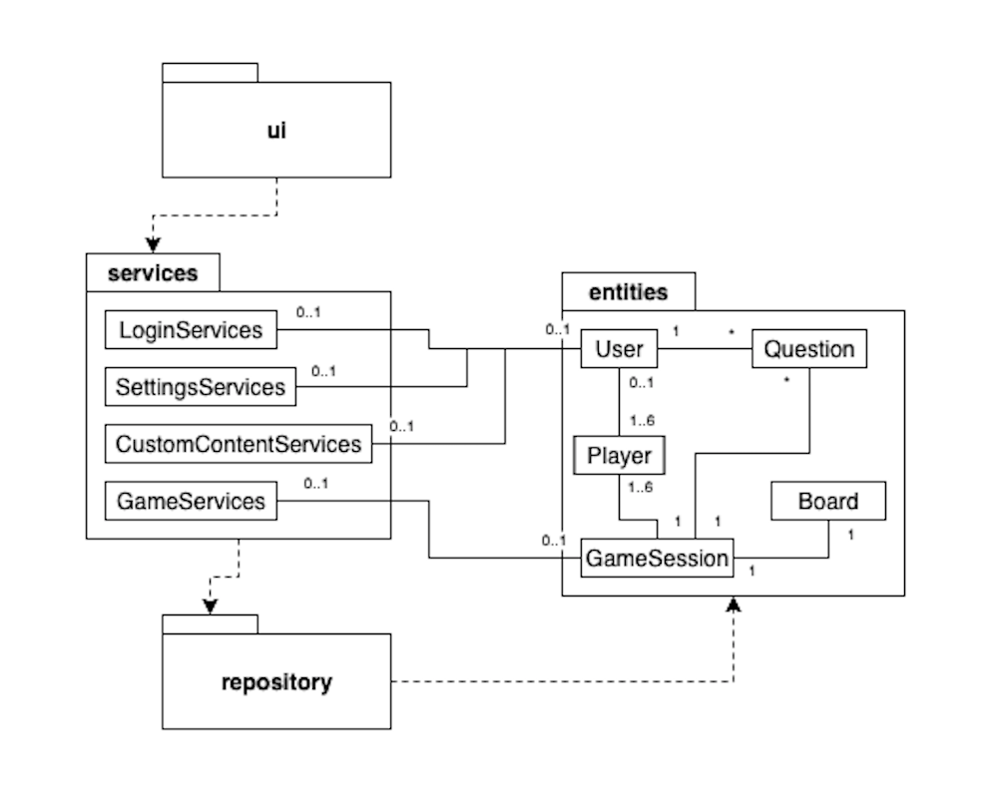
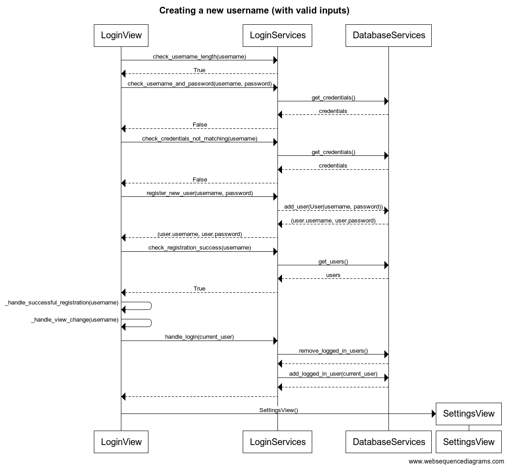

# Arkkitehtuurikuvaus

## Rakenne

Sovelluksen arkkitehtuuri on kolmitasoinen:

- Pakkaus "ui" tarkoittaa käyttöliittymästä vastaavaa koodia.
- Pakkaus "services" tarkoittaa sovelluslogiikasta vastaavaa koodia.
- Pakkaus "repository" tarkoittaa tietojen tallennuksesta vastaavaa koodia.

Lisäksi: pakkaus "entities" kuvastaa sovelluksen käyttämien tietokohteiden luokkia.

## Käyttöliittymä

Käyttöliittymä ("ui") on eristetty sovelluslogiikasta ("services") ja tietojen pysyväistallennuksesta ("repository"). Käyttöliittymä kutsuu tarvittaessa eri "services"-luokkia ja niiden metodeja, muttei koskaan "repository"-luokkaa.

Käyttöliittymä koostuu neljästä erillisestä päänäkymästä:

- "Login or Create Username",
- "Game Settings",
- "Custom Content",
- "Game Session".

Lisäksi

- "Custom Content" sisältää erillisen "Edit"-alanäkymän,
- "Game Settings" ja "Game Session" sisältävät erillisen "Rules"-alanäkymän,
- "Game Session" sisältää erillisen "Statistics"-alanäkymän.

Kaikki pää- ja alanäkymät on toteutettu omina luokkinaan. Pääsääntöisesti vain yksi näistä näkyy käyttäjälle kerrallaan, poikkeuksena "Rules"- ja "Statistics"-alanäkymät, jotka ilmestyvät olemassa olevan näkymän päälle omina ikkunoinaan.

## Palvelut

Palvelut koostuvat "services"-luokista, joita on yhteensä neljä:

- "LoginServices" vastaa kirjautumiseen liittyvistä palveluista.
- "SettingsServices" vastaa pelin asetuksiin liittyvistä palveluista.
- "CustomContentServices" vastaa käyttäjän luomien sisältöjen hallintaan liittyvistä palveluista.
- "GameServices" vastaa pelisessioon liittyvistä palveluista.

## Tietojen pysyväistallennus

Tietojen tallennuksesta vastaa "DatabaseServices"-luokka, joka on kaikkien "services"-luokkien käytössä. Kaikki tiedot tallennetaan SQLite-tietokantaan, joka koostuu kolmesta taulusta:

- "Users", joka säilöö käyttäjiin liittyvää tietoa,
- "Questions", joka säilöö kysymyksiin liittyvää tietoa,
- "Games", joka säilöö pelattuihin peleihin liittyvää tietoa.

Tietokantatiedoston nimi on konfiguroitavissa. 

## Päätoiminnallisuudet

Tässä osiossa kuvataan neljä sovelluksen päätoiminnallisuutta. Sovellus on verrattain laaja, joten monia tärkeitäkin toiminnallisuuksia jää väistämättä tarkastelun ulkopuolelle. Tässä kuvatut toiminnallisuudet antavat kuitenkin riittävän hyvän kuvan sovelluksen toiminnasta kokonaisuutena. Sovellus nimittäin noudattaa tiukasti kolmikerroksista arkkitehtuuria, jossa käyttöliittymäluokkien logiikka rajoittuu puhtaasti käyttöliittymän muokkaamiseen palveluluokkien antamien tietojen pohjalta. Palveluluokat puolestaan kutsuvat tarvittaessa niiden yhteiskäytössä olevaa tietokantapalveluluokkaa, joka säilöö tietoja käyttäjistä, kysymyksistä ja pelisessioista. 

### Kirjautuminen uutena käyttäjänä

Alla oleva sekvenssikaavio kuvaa kirjautumista uutena käyttäjänä asianmukaisilla syötteillä. Kirjautuminen olemassa olevana käyttäjänä mukailee samaa kaaviota, mutta on kokonaisuutena vain lyhyempi prosessi. Sekvenssikaavion tapahtumat alkavat siitä, kun käyttäjä on jo syöttänyt käyttäjätunnuksen ja salasanan ja painanut "Proceed"-painiketta. Kaaviossa ei siten kuvata esimerkiksi käyttöliittymän rakentumista tai palveluluokkien käynnistymistä.

Alla vielä yksityiskohtainen kuvaus sekvenssikaavion sisällöstä:

1. *LoginView* kutsuu *LoginServices*-luokan metodia *check_username_length* parametrinaan käyttäjän syöttämä käyttäjätunnus eli *username*. *LoginServices* palauttaa arvon *True*, mikäli käyttäjätunnus on riittävän pitkä eli vähintään 3 merkkiä. Tässä tapauksessa näin on. Mikäli arvo olisi *False*, sovellus ilmoittaisi käyttäjälle asiasta ja tilanne palautuisi sekvenssikaaviota edeltävään tilaan.

2. *LoginView* kutsuu *LoginServices*-luokan metodia *check_username_and_password* parametreinaan käyttäjän syöttämä käyttäjätunnus, eli *username*, ja salasana, eli *password*. *LoginServices* kutsuu *DatabaseServices*-luokan metodia *get_credentials*, joka palauttaa listan käyttäjien tunnuksista ja salasanoista. Mikäli *LoginServices* ei löydä käyttäjän syöttämiä tietoja tältä listalta, se palauttaa arvon *False*. Tässä tapauksessa näin on. Mikäli tiedot löytyisivät, *LoginServices* palauttaisi arvon *True*, jolloin käyttäjä tulkittaisiin olemassa olevaksi käyttäjäksi ja sovellus siirtyisi suoraan käsittelemään onnistunutta kirjautumista.

3. *LoginView* kutsuu *LoginServices*-luokan metodia *check_credentials_not_matching* parametrinaan käyttäjän syöttämä käyttäjätunnus eli *username*. Tällä siis varmistetaan, ettei kyse ole tilanteesta, jossa olemassa oleva käyttäjä on syöttänyt salasanansa väärin. *LoginServices*-luokalla on hieman ontuva muisti, joten se kutsuu uudelleen *DatabaseServices*-luokan metodia *get_credentials* saadakseen listan käyttäjien tunnuksista ja salasanoista. Mikäli *LoginServices* toteaa käyttäjän täysin uudeksi, se palauttaa arvon *False*. Mikäli kyse olisi tilanteesta, jossa käyttäjä on syöttänyt salasanansa väärin, *LoginServices* palauttaisi arvon *True*, sovellus ilmoittaisi käyttäjälle asiasta ja tilanne palautuisi sekvenssikaaviota edeltävään tilaan.

4. *LoginView* kutsuu *LoginServices*-luokan metodia *register_new_user* parametreinaan käyttäjän syöttämä käyttäjätunnus, eli *username*, ja salasana, eli *password*. *LoginServices* kutsuu *DatabaseServices*-luokan metodia *add_user* parametrinaan *User*-luokan olio. *DatabaseServices* palauttaa tiedon rekisteröidystä käyttäjätunnuksesta ja salasanasta *LoginServices*-luokalle, joka välittää tiedon *LoginView*-luokalle.

5. *LoginView* kutsuu *LoginServices*-luokan metodia *check_registration_success* parametrinaan käyttäjän syöttämä käyttäjätunnus, eli *username*. *LoginServices* kutsuu *DatabaseServices*-luokan metodia *get_users*, joka palauttaa listan käyttäjistä. Mikäli *LoginServices* löytää uuden käyttäjän listalta, se palauttaa arvon *True*. Tällä siis varmistetaan onnistunut rekisteröinti, jotta vältytään hankaluuksilta myöhemmin. 

6. *LoginView* kutsuu omia metodejaan *_handle_succesful_registration* ja *_handle_view_change* muun muassa tervehtiäkseen uutta käyttäjää. Tämän jälkeen *LoginView* kutsuu *LoginServices*-luokan metodia *handle_login*, joka puolestaan kutsuu *DatabaseServices*-luokan metodeja *remove_logged_in_users* ja *add_logged_in_user*. Näistä ensimmäinen poistaa varmuudeksi kaikki edelliset aktiiviset kirjautumiset ja jälkimmäinen lisää nykyisen käyttäjän kirjautuneeksi, koska tätä tietoa tarvitaan myöhemmin.

7. *LoginView* kutsuu *SettingsView*-luokkaa, jolloin *LoginView* tuhoutuu ja *SettingsView* aukeaa.

### Oman kysymyksen lisääminen

Tulossa.

### Pelin aloitus

Tulossa.

### Pelin kulku

Tulossa.

