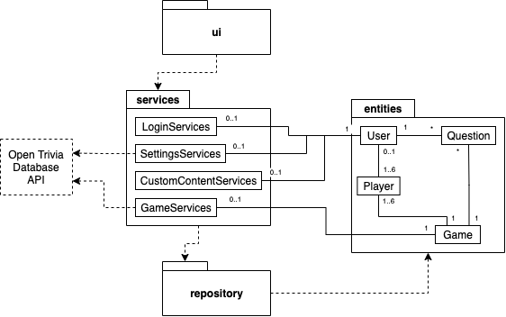

# Arkkitehtuurikuvaus

## Rakenne

Sovelluksen arkkitehtuuri on kolmitasoinen:

Yllä olevassa kuvassa

- "ui" = käyttöliittymästä vastaava koodi.
- "services" = sovelluslogiikasta vastaava koodi.
- "repository" = tietojen tallennuksesta vastaava koodi.
- "entities" = sovelluksen käyttämien tietokohteiden koodi.

## Käyttöliittymä

Käyttöliittymä ("ui") on eristetty sovelluslogiikasta ("services", palvelut) ja tietojen pysyväistallennuksesta ("repository", tallennus). Käyttöliittymä kutsuu tarvittaessa eri palveluluokkia ja niiden metodeja, muttei koskaan tallennusluokkaa tai sen metodeja. Käyttöliittymä on toteutettu [tkinter](https://docs.python.org/3/library/tkinter.html)-pakkausta hyödyntäen.

Käyttöliittymä koostuu neljästä erillisestä päänäkymästä, jotka ovat

- "Login or Create Username", jota kuvastaa luokka LoginView,
- "Game Settings", jota kuvastaa luokka SettingsView,
- "Custom Content", jota kuvastaa luokka CustomContentView,
- "Game Session", jota kuvastaa luokka GameView.

Lisäksi

- "Custom Content" sisältää erillisen "Edit"-alanäkymän, jota kuvastaa luokka EditView,
- "Game Settings" ja "Game Session" sisältävät erillisen "Rules"-alanäkymän, jota kuvastaa luokka RulesView,
- "Game Session" sisältää erillisen "Statistics"-alanäkymän, jota kuvastaa luokka StatisticsView.

Kaikki pää- ja alanäkymät on siis toteutettu omina luokkinaan. Pääsääntöisesti vain yksi näistä näkyy käyttäjälle kerrallaan, poikkeuksena "Rules"- ja "Statistics"-alanäkymät, jotka ilmestyvät olemassa olevan näkymän päälle omina ikkunoinaan.

## Sovelluslogiikka ja palvelut

Sovelluksen logiikkakerroksen muodostavia palveluluokkia on yhteensä neljä:

- "LoginServices" vastaa kirjautumiseen ("LoginView") liittyvistä palveluista,
- "SettingsServices" vastaa pelin asetuksiin ("SettingsView") liittyvistä palveluista,
- "CustomContentServices" vastaa käyttäjän luomien sisältöjen hallintaan ("CustomContentView" ja "EditView") liittyvistä palveluista,
- "GameServices" vastaa pelisessioon ("GameView" ja "StatisticsView") liittyvistä palveluista.

Kukin edellä luetelluista luokista käsittelee siis vain sille kuuluvilta käyttöliittymäluokilta tulevia kutsuja. "RulesView"-luokkaa ei palvella sovelluslogiikkakerroksella lainkaan, sillä sen sisältö on staattinen.

Kun tietoja tarvitsee tallentaa, palveluluokat kutsuvat "repository"-kerroksen tallennusluokkaa. Palvelut eivät siis koskaan ole suoraan tekemisissä pysyväistallennuksen kanssa, mikä mahdollistaa esimerkiksi tallennusmuodon vaihtamisen moduulimaisesti tarvittaessa.

## Tietojen pysyväistallennus

Tietojen pysyväistallennuksesta vastaa luokka "DatabaseServices", joka on kaikkien palveluluokkien yhteiskäytössä. Kaikki tiedot tallennetaan SQLite-tietokantaan, joka koostuu kolmesta taulusta:

- "Users" = käyttäjien kirjautumiseen liittyvä tieto,
- "Questions" = kysymyksiin liittyvä tieto,
- "Games" = aloitettuihin pelisessioihin liittyvä tieto.

Kuten edellä jo viitattiin, vain "DatabaseServices"-luokka on suoraan tekemisissä tietokannan kanssa, minkä ansiosta tallennusmuoto on tarvittaessa vaihdettavissa moduulimaisesti.

Sovellus luo käynnistymisensä yhteydessä tietojen tallennukseen käytettävät tietokantatiedostot automaattisesti juurihakemiston yläpuoleiseen kansioon, jossa esimerkiksi projektin README sijaitsee, mikäli kyseisiä tiedostoja ei vielä ole. Tiedostojen nimet voi tarvittaessa konfiguroida tiedostossa config.py, joka löytyy projektin juurihakemistosta ("src").

## Päätoiminnallisuudet

Tässä osiossa kuvataan neljä sovelluksen päätoiminnallisuutta. Sovellus on verrattain laaja, joten monia tärkeitäkin toiminnallisuuksia jää väistämättä tarkastelun ulkopuolelle. Tässä kuvatut toiminnallisuudet antavat kuitenkin riittävän hyvän kuvan sovelluksen toiminnasta kokonaisuutena. Sovellus noudattaa nimittäin tiukasti kolmikerroksista arkkitehtuuria, jossa käyttöliittymäluokkien logiikka rajoittuu puhtaasti käyttöliittymän muokkaamiseen palveluluokkien antamien tietojen pohjalta. Palveluluokat puolestaan kutsuvat tarvittaessa niiden yhteiskäytössä olevaa tietokantapalveluluokkaa, joka hallinnoi käyttäjien, kysymysten ja pelisessioiden tietojen säilöntää. 

### Kirjautuminen uutena käyttäjänä

Alla oleva sekvenssikaavio kuvaa kirjautumista uutena käyttäjänä asianmukaisilla syötteillä. Kirjautuminen olemassa olevana käyttäjänä mukailee samaa kaaviota, mutta on prosessina vain lyhyempi. Sekvenssikaavion tapahtumat alkavat siitä, kun käyttäjä on jo syöttänyt kirjautumistiedot ja painanut "Proceed"-painiketta. Kaaviossa ei siten kuvata esimerkiksi käyttöliittymän rakentumista tai palveluluokkien käynnistymistä.

1. *LoginView* kutsuu *LoginServices*-luokan metodia *check_username_length* parametrinaan käyttäjän syöttämä käyttäjätunnus eli *username*. *LoginServices* palauttaa arvon *True*, mikäli käyttäjätunnus on riittävän pitkä eli vähintään 3 merkkiä. Tässä tapauksessa näin on. Mikäli arvo olisi *False*, sovellus ilmoittaisi käyttäjälle asiasta ja tilanne palautuisi sekvenssikaaviota edeltävään tilaan.

2. *LoginView* kutsuu *LoginServices*-luokan metodia *check_username_and_password* parametreinaan käyttäjän syöttämä käyttäjätunnus, eli *username*, ja salasana, eli *password*. *LoginServices* kutsuu *DatabaseServices*-luokan metodia *get_credentials*, joka palauttaa listan käyttäjien tunnuksista ja salasanoista. Mikäli *LoginServices* ei löydä käyttäjän syöttämiä tietoja tältä listalta, se palauttaa arvon *False*. Tässä tapauksessa näin on. Mikäli tiedot löytyisivät, *LoginServices* palauttaisi arvon *True*, jolloin käyttäjä tulkittaisiin olemassa olevaksi käyttäjäksi ja sovellus siirtyisi suoraan käsittelemään onnistunutta kirjautumista.

3. *LoginView* kutsuu *LoginServices*-luokan metodia *check_credentials_not_matching* parametrinaan käyttäjän syöttämä käyttäjätunnus eli *username*. Tällä siis varmistetaan, ettei kyse ole tilanteesta, jossa olemassa oleva käyttäjä on syöttänyt salasanansa väärin. *LoginServices*-luokalla on hieman ontuva muisti, joten se kutsuu uudelleen *DatabaseServices*-luokan metodia *get_credentials* saadakseen listan käyttäjien tunnuksista ja salasanoista. Mikäli *LoginServices* toteaa käyttäjän täysin uudeksi, se palauttaa arvon *False*. Tässä tapauksessa näin on. Mikäli kyse olisi tilanteesta, jossa käyttäjä on syöttänyt salasanansa väärin, *LoginServices* palauttaisi arvon *True*, sovellus ilmoittaisi käyttäjälle asiasta ja tilanne palautuisi sekvenssikaaviota edeltävään tilaan.

4. *LoginView* kutsuu *LoginServices*-luokan metodia *register_new_user* parametreinaan käyttäjän syöttämä käyttäjätunnus, eli *username*, ja salasana, eli *password*. *LoginServices* kutsuu samoilla parametreilla *DatabaseServices*-luokan metodia *add_user*, joka lisää käyttäjätunnuksen tietokantaan.

5. *LoginView* kutsuu *LoginServices*-luokan metodia *check_registration_success* parametrinaan käyttäjän syöttämä käyttäjätunnus, eli *username*. *LoginServices* kutsuu *DatabaseServices*-luokan metodia *get_users*, joka palauttaa listan käyttäjistä. Mikäli *LoginServices* löytää uuden käyttäjän listalta, se palauttaa arvon *True*. Tällä siis varmistetaan onnistunut rekisteröinti, jotta vältytään hankaluuksilta myöhemmin. 

6. *LoginView* kutsuu omia metodejaan *_handle_succesful_registration* ja *_handle_view_change* muun muassa tervehtiäkseen uutta käyttäjää. Tämän jälkeen *LoginView* kutsuu *LoginServices*-luokan metodia *handle_login*, joka puolestaan kutsuu *DatabaseServices*-luokan metodeja *remove_logged_in_users* ja *add_logged_in_user*. Näistä ensimmäinen poistaa varmuudeksi kaikki edelliset aktiiviset kirjautumiset ja jälkimmäinen lisää nykyisen käyttäjän kirjautuneeksi, koska tätä tietoa tarvitaan myöhemmin.

7. *LoginView* kutsuu *SettingsView*-luokan metodia *initialize_window*, jolloin *LoginView* tuhoutuu ja *SettingsView* aukeaa.

### Oman kysymyksen lisääminen

Tulossa.

### Pelin aloitus

Tulossa.

### Pelin kulku

Tulossa.

