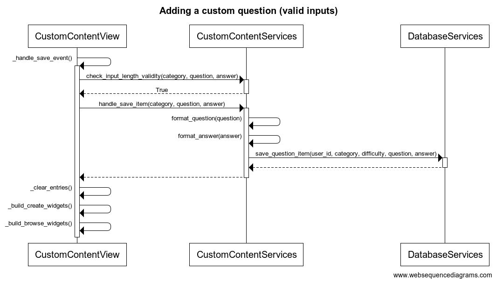
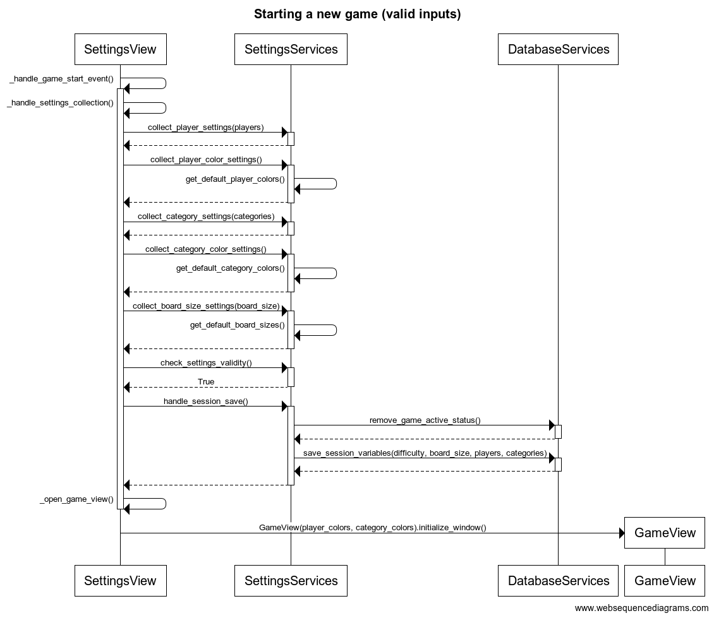

# Arkkitehtuurikuvaus

## Rakenne

Sovelluksen arkkitehtuuri on kolmitasoinen:

Yllä olevassa kuvassa

- "ui" = käyttöliittymästä vastaava koodi.
- "services" = sovelluslogiikasta vastaava koodi.
- "repository" = tietojen tallennuksesta vastaava koodi.
- "entities" = sovelluksen käyttämien tietokohteiden koodi.

## Käyttöliittymä

Käyttöliittymä ("ui") on eristetty sovelluslogiikasta ("services", palvelut) ja tietojen pysyväistallennuksesta ("repository", tallennus). Käyttöliittymä kutsuu tarvittaessa eri palveluluokkia ja niiden metodeja, muttei koskaan tallennusluokkaa tai sen metodeja. Käyttöliittymä on toteutettu [tkinter](https://docs.python.org/3/library/tkinter.html)-pakkausta hyödyntäen.

Käyttöliittymä koostuu neljästä erillisestä päänäkymästä, jotka ovat

- "Login or Create Username", jota kuvastaa luokka LoginView,
- "Game Settings", jota kuvastaa luokka SettingsView,
- "Custom Content", jota kuvastaa luokka CustomContentView,
- "Game Session", jota kuvastaa luokka GameView.

Lisäksi

- "Custom Content" sisältää erillisen "Edit"-alanäkymän, jota kuvastaa luokka EditView,
- "Game Settings" ja "Game Session" sisältävät erillisen "Rules"-alanäkymän, jota kuvastaa luokka RulesView,
- "Game Session" sisältää erillisen "Statistics"-alanäkymän, jota kuvastaa luokka StatisticsView.

Kaikki pää- ja alanäkymät on siis toteutettu omina luokkinaan. Pääsääntöisesti vain yksi näistä näkyy käyttäjälle kerrallaan, poikkeuksena "Rules"- ja "Statistics"-alanäkymät, jotka ilmestyvät olemassa olevan näkymän päälle omina ikkunoinaan.

## Sovelluslogiikka ja palvelut

Sovelluksen logiikkakerroksen muodostavia palveluluokkia on yhteensä neljä:

- "LoginServices" vastaa kirjautumiseen ("LoginView") liittyvistä palveluista,
- "SettingsServices" vastaa pelin asetuksiin ("SettingsView") liittyvistä palveluista,
- "CustomContentServices" vastaa käyttäjän luomien sisältöjen hallintaan ("CustomContentView" ja "EditView") liittyvistä palveluista,
- "GameServices" vastaa pelisessioon ("GameView" ja "StatisticsView") liittyvistä palveluista.

Kukin edellä luetelluista luokista käsittelee siis vain sille kuuluvilta käyttöliittymäluokilta tulevia kutsuja. "RulesView"-luokkaa ei palvella sovelluslogiikkakerroksella lainkaan, sillä sen sisältö on staattinen.

Kun tietoja tarvitsee tallentaa, palveluluokat kutsuvat "repository"-kerroksen tallennusluokkaa. Palvelut eivät siis koskaan ole suoraan tekemisissä pysyväistallennuksen kanssa, mikä mahdollistaa esimerkiksi tallennusmuodon vaihtamisen moduulimaisesti tarvittaessa.

## Tietojen pysyväistallennus

Tietojen pysyväistallennuksesta vastaa luokka "DatabaseServices", joka on kaikkien palveluluokkien yhteiskäytössä. Kaikki tiedot tallennetaan SQLite-tietokantaan, joka koostuu kolmesta taulusta:

- "Users" = käyttäjien kirjautumiseen liittyvä tieto,
- "Questions" = kysymyksiin liittyvä tieto,
- "Games" = aloitettuihin pelisessioihin liittyvä tieto.

Kuten edellä jo viitattiin, vain "DatabaseServices"-luokka on suoraan tekemisissä tietokannan kanssa, minkä ansiosta tallennusmuoto on tarvittaessa vaihdettavissa moduulimaisesti.

Sovellus luo käynnistymisensä yhteydessä tietojen tallennukseen käytettävät tietokantatiedostot automaattisesti juurihakemiston yläpuoleiseen kansioon, jossa esimerkiksi projektin README sijaitsee, mikäli kyseisiä tiedostoja ei vielä ole. Tiedostojen nimet voi tarvittaessa konfiguroida tiedostossa config.py, joka löytyy projektin juurihakemistosta ("src").

## Päätoiminnallisuudet

Tässä osiossa kuvataan neljä sovelluksen päätoiminnallisuutta. Sovellus on verrattain laaja, joten monia tärkeitäkin toiminnallisuuksia jää väistämättä tarkastelun ulkopuolelle. Tässä kuvatut toiminnallisuudet antanevat kuitenkin riittävän hyvän kuvan sovelluksen toiminnasta kokonaisuutena. Sovellus noudattaa nimittäin tiukasti kolmikerroksista arkkitehtuuria, jossa käyttöliittymäluokkien logiikka rajoittuu puhtaasti käyttöliittymän muokkaamiseen palveluluokkien antamien tietojen pohjalta. Palveluluokat puolestaan kutsuvat tarvittaessa niiden yhteiskäytössä olevaa tietokantapalveluluokkaa, joka hallinnoi käyttäjien, kysymysten ja pelisessioiden tietojen säilöntää. 

Yksinkertaistuksen vuoksi alla olevista kuvauksista on jätetty pois joitakin käyttöliittymän rakentumiseen liittyviä metodikutsuja sekä luokan *DatabaseServices* sisällä tapahtuvat varsinaiset tietojen pysyväistallennukseen liittyvät tietokantakutsut.

### Kirjautuminen uutena käyttäjänä

Alla oleva sekvenssikaavio kuvaa kirjautumista uutena käyttäjänä asianmukaisilla syötteillä. Kirjautuminen olemassa olevana käyttäjänä mukailee samaa kaaviota, mutta on prosessina vain lyhyempi. Sekvenssikaavion tapahtumat alkavat siitä, kun käyttäjä on jo syöttänyt kirjautumistiedot ja painanut "Proceed"-painiketta. 

1. *LoginView* kutsuu sisäistä metodiaan *_handle_login_event*, joka kerää käyttöliittymän kentistä käyttäjän syöttämät arvot ja lähettää ne luokalle *LoginServices* kutsumalla sen metodia *check_username_length* parametrinaan käyttäjän syöttämä käyttäjänimi. *LoginServices* palauttaa arvon *True*, mikäli käyttäjänimi on riittävän pitkä. Tässä tapauksessa näin on. Mikäli arvo olisi *False*, sovellus ilmoittaisi käyttäjälle asiasta ja tilanne palautuisi sekvenssikaaviota edeltävään tilaan.

2. *LoginView* kutsuu luokan *LoginServices* metodia *check_username_and_password* parametreinaan käyttäjän syöttämä käyttäjänimi ja salasana. *LoginServices* kutsuu luokan *DatabaseServices* metodia *get_credentials*, joka palauttaa listan käyttäjien tunnuksista ja salasanoista. Mikäli *LoginServices* ei löydä käyttäjän syöttämiä tietoja tältä listalta, se palauttaa arvon *False*. Tässä tapauksessa näin on. Mikäli tiedot löytyisivät, *LoginServices* palauttaisi arvon *True*, jolloin käyttäjä tulkittaisiin olemassa olevaksi käyttäjäksi ja sovellus siirtyisi suoraan käsittelemään onnistunutta kirjautumista.

3. *LoginView* kutsuu luokan *LoginServices* metodia *check_credentials_not_matching* parametrinaan käyttäjän syöttämä käyttäjänimi. Tällä siis varmistetaan, ettei kyse ole tilanteesta, jossa olemassa oleva käyttäjä on syöttänyt salasanansa väärin. Tarkistuken avuksi *LoginServices* kutsuu luokan *DatabaseServices* metodia *get_credentials* saadakseen listan käyttäjien tunnuksista ja salasanoista. Mikäli *LoginServices* toteaa käyttäjän uudeksi, se palauttaa arvon *False*. Tässä tapauksessa näin on. Mikäli kyse olisi tilanteesta, jossa olemassa oleva käyttäjä on syöttänyt salasanansa väärin, *LoginServices* palauttaisi arvon *True*, sovellus ilmoittaisi käyttäjälle asiasta ja tilanne palautuisi sekvenssikaaviota edeltävään tilaan.

4. *LoginView* kutsuu luokan *LoginServices* metodia *register_new_user* parametreinaan käyttäjän syöttämä käyttäjänimi ja salasana. *LoginServices* kutsuu samoilla parametreilla luokan *DatabaseServices* metodia *add_user*, joka lisää käyttäjätunnuksen tietokantaan.

5. *LoginView* kutsuu luokan *LoginServices* metodia *check_registration_success* parametrinaan käyttäjän syöttämä käyttäjänimi. *LoginServices* kutsuu luokan *DatabaseServices* metodia *get_users*, joka palauttaa listan käyttäjistä. Mikäli *LoginServices* löytää uuden käyttäjän listalta, se palauttaa arvon *True*. Tällä siis varmistetaan onnistunut rekisteröinti, jotta vältytään hankaluuksilta myöhemmin. 

6. *LoginView* kutsuu sisäisiä metodejaan *_handle_succesful_registration* ja *_handle_view_change* muun muassa tervehtiäkseen uutta käyttäjää. Tämän jälkeen *LoginView* kutsuu luokan *LoginServices* metodia *handle_login*, joka puolestaan kutsuu luokan *DatabaseServices* metodeja *remove_logged_in_users* ja *add_logged_in_user*. Näistä ensimmäinen poistaa varmuudeksi kaikki edelliset aktiiviset kirjautumiset ja jälkimmäinen lisää nykyisen käyttäjän kirjautuneeksi, koska tätä tietoa tarvitaan myöhemmin.

7. *LoginView* kutsuu luokan *SettingsView* metodia *initialize_window*, jolloin nykyinen ikkuna sulkeutuu ja peliasetusten ikkuna avautuu.

### Oman kysymyksen lisääminen

Alla oleva sekvenssikaavio kuvaa oman kysymyksen lisäämistä asianmukaisilla syötteillä. Kaavion tapahtumat alkavat siitä, kun käyttäjä on jo syöttänyt kenttiin asianmukaiset tiedot ja painanut "Save"-painiketta.

1. *CustomContentView* kutsuu sisäistä metodiaan *_handle_save_event*, joka kerää käyttöliittymän kentistä käyttäjän syöttämät arvot ja lähettää ne luokalle *CustomContentServices* tarkistettaviksi kutsumalla metodia *check_input_validity* parametreinaan käyttäjän syöttämät tiedot. Mikäli syötteet eivät sisällä tyhjiä arvoja, *CustomContentServices* palauttaa arvon *True*. Tässä tapauksessa näin on. Mikäli palautunut arvo olisi *False*, sovellus ilmoittaisi käyttäjälle asiasta ja tilanne palautuisi sekvenssikaaviota edeltävään tilaan. 

2. Saatuaan tiedoksi arvon *True* *CustomContentView* kutsuu luokan *CustomContentServices* metodia *handle_save_item* parametreinaan jälleen käyttäjän syöttämät tiedot. *CustomContentServices* tarkistaa sisäisillä metodikutsuilla *format_question* ja *format_answer*, että käyttäjän syöttämä kysymys ja vastaus päättyvät oikeanlaiseen välimerkkiin.

3. *CustomContentServices* kutsuu luokan *DatabaseServices* metodia *save_question_item* parametreinaan nykyisen käyttäjän id-numero ja luokalta *CustomContentView* saamansa syötteet. *DatabaseServices* tallentaa tiedot tietokantaan.

4. Tietojen tallennuksen jälkeen *CustomContentView* kutsuu sisäisiä metodejaan *_clear_entries*, *_build_create_widgets* ja *_build_browse_widgets*, joista ensimmäinen tyhjentää käyttöliittymässä olevat kentät ja jälkimmäiset rakentavat käyttöliittymän widgetit uudelleen. Näin käyttäjän tekemät muutokset näkyvät heti käyttöliittymässä.

### Pelin aloitus

Alla oleva sekvenssikaavio kuvaa uuden pelin aloittamista asianmukaisilla syötteillä. Kaavion tapahtumat alkavat siitä, kun käyttäjä on jo syöttänyt kenttiin asianmukaiset tiedot ja painanut "Start Game"-painiketta.

1. *SettingsView* kutsuu sisäistä metodiaan *_handle_save_event*, joka lähettää käyttäjän valitsemat peliasetukset luokalle *SettingsServices* asetustyyppi kerrallaan. Kaaviossa tätä kuvaavat kaikki *collect*-alkuiset metodikutsut. Koska käyttöliittymä ei vielä tue pelaajien ja kategorioiden värien valitsemista, *SettingsServices* kutsuu näiden kohdalla sisäisiä metodeitaan (kaaviossa *get_default*-alkuiset metodit) saadakseen oletusarvot tietoonsa. *SettingsServices* palauttaa kunkin peliasetuksen arvon, jotta niitä voidaan helposti käsitellä myöhemmin.

2. Peliasetusten keräämisen jälkeen *SettingsView* kutsuu luokan *SettingsServices* *check*-alkuisia metodeja, jotka varmistavat, että käyttäjän valitsemat asetukset ovat ehtojen mukaiset. Tässä tapauksessa näin on. Mikäli pelaajien nimet tai pelaajien tai kategorioiden määrät eivät täyttäisi ehtoja, *SettingsServices* palauttaisi arvon *True*, sovellus ilmoittaisi asiasta käyttäjälle ja tilanne palautuisi kaaviota edeltävänä tilaan.

3. *SettingsView* kutsuu luokan *SettingsServices* metodia *handle_session_save*, joka puolestaan kutsuu luokan *DatabaseServices* metodeja *remove_game_active_status* ja *save_session_variables*. Näistä ensimmäinen poistaa varmuudeksi aiempien pelisessioiden *active*-statuksen. Jälkimmäinen puolestaan tallentaa uuden pelin tiedot tietokantaan ja asettaa pelisession aktiiviseksi.

4. *SettingsView* kutsuu sisäistä metodiaan *_open_game_view*, joka sulkee nykyisen ikkunan ja kutsuu uutta *GameView*-oliota. Samalla *SettingsView* kutsuu luokan *GameView* metodia *initialize_window*, joka avaa uuden pelinäkymän ikkunan.

### Pelivuoron kulku

Alla oleva sekvenssikaavio kuvaa yksittäisen pelivuoron kulkua tilanteessa, jossa pelaaja vastaa kysymykseen oikein eikä tällä vielä ole kategoriapistettä. Kaavion tapahtumat alkavat siitä, kun edellisen pelaajan vuoro on päättynyt. Toisin kuin edellisten sekvenssien kohdalla, tähän liittyvä selostus ei erittele aivan jokaista yksityiskohtaa, jotta kuvauksen pituus pysyisi kohtuullisena.

1. Kun pelaaja painaa *Cast*-painiketta, *GameView* kutsuu *GameServices*-luokkaa saadakseen tiedon nopan silmäluvusta nopan piirtämistä varten. *GameView* saa toisella kutsulla myös tiedon pelinappuloiden uusista sijainneista piirtämistä varten (*player_positions_radii*). *GameServices* päivittää uudet sijainnit myös indeksiarvoina (*player_positions_indices*), jotta se tietää, millä kategoriasegmenteillä nappulat kulloinkin ovat. Tämän jälkeen tarkastetaan, täyttikö pelaaja ehdot pelin voittamiselle. Tässä tapauksessa ei. Mikäli näin kuitenkin olisi, sovellus ilmoittaisi asiasta käyttäjälle, peli päättyisi ja käyttäjälle annettaisiin mahdollisuus siirtyä pelin asetuksiin.

2. Kun nopanheittoon liittyvät toimenpiteet on tehty, *GameView* siirtyy pelivuoron kysymysvaiheeseen (*_handle_question_phase*). *GameView* kysyy *GameServices*-luokalta tiedon nykyisestä kategoriasta, jotta se osaa korostaa sen kategoriataulusta (*CategoryBoard*). Tämän jälkeen *GameView* kysyy *GameServices*-luokalta tiedon pelaajalta kysyttävästä kysymyksestä. *GameServices* välittää kysymyksen *DatabaseServices*-luokalle, joka palauttaa kysymyksen *GameServices*-luokan kautta *GameView*-luokalle. Sama prosessi toistetaan oikean vastauksen hakemiseksi.

3. Kun käyttäjä on painikkeella vahvistanut pelaajan vastauksen oikeellisuuden, *GameView* siirtyy käsittelemään oikeaa vastausta. *GameView* kutsuu *GameServices*-luokan metodia *add_point_to_player*, joka päivittää pelaajan pisteet (väärän vastauksen kohdalla metodi olisi *remove_point_from_player*, muutoin prosessi olisi täsmälleen sama). *GameServices* palauttaa tiedon pisteistä, minkä jälkeen siirrytään vuoron lopetusvaiheeseen.

4. Vuoron lopetusvaiheessa *GameView* piirrättää pistetaulun (*Scoreboard*) uudelleen saamiensa tietojen pohjalta ja poistattaa edelliset korostimet sekä piste- että kategoriataululta. Tämän jälkeen *GameServices* päivittää tiedon pelaajan vuoron vaihtumisesta ja *GameView* piirrättää sen perusteella uuden korostimen pistetaululle. Lopuksi *GameView* piirtää nopanheittopainikkeen uudelleen, ja uusi vuoro alkaa. 

## Sovelluksen rakenteeseen jääneet parannuskohteet

Sovelluksen pelisessioon liittyvissä luokissa *GameView* ja *GameServices* on hieman liikaa attribuutteja. *GameView*-luokan osalta tämä johtuu lähinnä tkinter-widgetteihin liittyvistä kankeuksista. *GameServices*-luokan attribuutteja tulisi jakaa enemmän *Player*-olioiden vastuulle, mutta tähän ei enää oikein aika riittänyt. Pylint ilmoittaa myös toisteisesta koodista joissain tiedostoissa, mutta tämä koskee lähinnä testausluokkia ja importteja.
