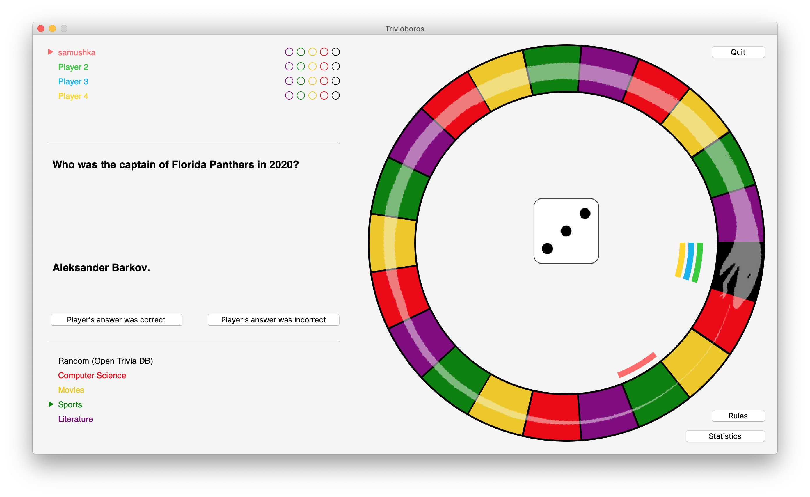

# Käyttöohje

## Asennus

1. Lataa uusin [release](https://github.com/samushka13/ot-harjoitustyo/releases).

2. Varmista, että koneellasi on asianmukainen [Python](https://www.python.org/)-versio (^3.6) ja [Poetry](https://python-poetry.org/)-versio (^1.1.5 suositeltu).

3. Asenna projektin riippuvuudet komennolla:

       poetry install

4. Konfiguroi tarvittaessa tallennustiedostojen nimet [tämän ohjeen](https://github.com/samushka13/ot-harjoitustyo/blob/master/dokumentaatio/kayttoohje.md#konfigurointi) mukaisesti (valinnainen).

5. Käynnistä sovellus komennolla:

       poetry run invoke start

### Järjestelmävaatimukset

Mikäli pelisessioon valitaan kategoria "Random (Open Trivia DB)", joka hakee tietoja kutsumalla [Open Trivia Database API:a](https://opentdb.com/api_config.php), internet-yhteys on välttämätön. Omilla kategorioilla pelatessa internet-yhteyttä ei tarvita.

### Konfigurointi

Sovellus luo käynnistymisensä yhteydessä tietojen tallennukseen käytettävät tietokantatiedostot automaattisesti juurihakemiston yläpuoleiseen kansioon, jossa esimerkiksi projektin README sijaitsee, mikäli kyseisiä tiedostoja ei vielä ole. Tiedostojen nimiä voi tarvittaessa muokata [konfiguraatiotiedostossa](https://github.com/samushka13/ot-harjoitustyo/blob/master/config.txt), joka löytyy projektin juurihakemiston yläpuoleisesta kansiosta.

Nimet on oltava mallia "tiedoston_nimi.db", eli konfiguraatiotiedostossa tulee muokata käytännössä vain yhtäsuuruusmerkkien ja pisteiden välisiä alueita. Mikäli tiedoston nimi on kirjoitettu virheellisesti, sovellus luo tiedoston oletusarvoisella nimellä "trivioboros.db" tai "trivioboros_tests.db" riippuen siitä, kummasta tiedostosta on kyse.

Mikäli sovelluksen käyttöliittymän ikkunat näyttävät pienehköiltä, kannattaa kokeilla näytön resoluution muuttamista. Valitettavasti sovellus ei taivu ikkunan koon muuttamiseen, sillä erityisesti pelinäkymän kohdalla tämä olisi tuottanut huomattavan määrän toteutuksellisia haasteita.

### Käyttöjärjestelmien väliset erot 

Sovelluksen ulkonäkö voi hieman vaihdella käyttöjärjestelmästä riippuen. Parhaan kokemuksen saa macOS-käyttöjärjestelmillä, mutta sovellus toimii toki myös Linuxilla, joskin asteen karkeamman näköisenä. Sovellus saattaa toimia myös Windowsilla, mutta tätä ei ole testattu.

## Sovelluksen käyttäminen

### Kirjautuminen

Sovellus käynnistyy kirjautumisnäkymään, josta pystyy sekä kirjautumaan olemassa olevilla tunnuksilla että luomaan uusia tunnuksia. Käyttäjänimen pituus on oltava vähintään kolme merkkiä. Salasana on vapaaehtoinen.

Painikkeet:

- "Proceed": kirjaa käyttäjän sisään sovellukseen syötetyillä tunnuksilla.
- "Users": näyttää listan tietokannassa olevista rekisteröityneistä käyttäjänimistä.

### Pelin asetukset

Kirjautumisen jälkeen avautuu valikkonäkymä, jossa voi esimerkiksi valita pelin asetukset. Pelin aloittamiseksi vaaditaan vähintään yksi pelaaja ja kaksi kategoriaa. Tyhjiä tai geneerisiä oletusarvoja ei huomioida, joten esimerkiksi alla oleva peli käynnistyisi neljällä pelaajalla ja viidellä kategorialla. Asetuksista voi säätää myös pelilaudan kokoa. Kokeile rohkeasti erilaisia vaihtoehtoja!

Painikkeet:

- "Logout": kirjaa ulos ja avaa kirjautumisnäkymän.
- "Custom Content": avaa omien kysymysten hallinnointinäkymän.
- "Rules": näyttää pelin säännöt.
- "About Open Trivia DB": näyttää lisätietoja [Open Trivia Databasesta](https://opentdb.com/).
- "Start Game": aloittaa pelin valituilla asetuksilla.

### Omat kysymykset

Omien kysymysten hallintanäkymässä on kaksi osaa. Oikeanpuoleisessa näkymän osassa voi luoda omia kysymyksiä täyttämällä vaaditut tiedot. 

Vasemmanpuoleisessa osassa voi puolestaa selata ja muokata jo luotuja kysymyksiä. Mikäli yksikään rekisteröity käyttäjä ei ole luonut omia kysymyksiä, lista olisi tyhjä. Alla olevassa kuvassa kysymyksiä on kuitenkin jo aiemmin luotu. Kullakin rivillä on ilmoitettu kysymyksen numero, kategoria, haastavuus, kysymys, vastaus ja luoja.

Painikkeet:

- "Clear": tyhjentää kenttiin täytetyt tiedot.
- "Save": tallentaa täytetyt tiedot.
- "Back to Settings": sulkee ikkunan ja avaa pelin asetusten näkymän.
- "Edit": avaa valitulle kysymykselle muokkausnäkymän.
- "Delete selected": poistaa käyttäjälle kuuluvat valitut kysymykset.
- "Delete all": poistaa kaikki käyttäjälle kuuluvat kysymykset.

### Pelin kulku

Aloitustilassa peli voi näyttää esimerkiksi tältä:

Pelinäkymän osat ovat

- vasemmassa yläkulmassa oleva pistetaulukko,
- vasemmassa keskiosassa oleva kysymys- ja vastaustila,
- vasemmassa alakulmassa oleva kategoriataulukko,
- oikeassa laidassa oleva pelilauta.

Pelin aloittaa vasemmassa ylälaidassa olevan osoittimen osoittama pelaaja. Peli alkaa noppaa 'heittämällä'.

Painikkeet:

- "Cast": arpoo nopan silmäluvun.
- "Quit": lopettaa pelin ja avaa pelin asetusten näkymän.
- "Rules": näyttää pelin säännöt.
- "Statistics": näyttää pelinaikaiset tilastot.

Nopan 'heittämisen' jälkeen pelivuorossa oleva pelaaja siirtyy automaattisesti nopan osoittaman silmäluvun verrran pelilaudalla. Samalla näkymän vasempaan osaan ilmestyy pelilaudan kategoriaruutua vastaava kysymys. 

Painikkeet:

- "Show answer": näyttää oikean vastauksen kysymykseen.

Kun pelaaja on vastannut kysymykseen, oikea vastaus saadaan esiin "Show answer" -painikkeella. Tämän jälkeen näkymään ilmestyy oikea vastaus ja painikkeet, joilla pelaajan vastaus vahvistetaan joko oikeaksi ("Player's answer was correct") tai vääräksi ("Player's answer was incorrect").

Painikkeet:

- "Player's answer was correct": pelaaja saa kategoriapisteen, mikäli kategoriassa ei vielä ole pistettä.
- "Player's answer was incorrect": pelaaja menettää kategoriapisteen, mikäli kategoriassa on piste.

Tässä tapauksessa pelaaja vastasi oikein, joten tämä sai pisteen kyseiseen kategoriaan. Vuoro päättyy, ja tilanne näyttää seuraavanlaiselta:

Kun peli jatkuu jonkin aikaa, se voi näyttää esimerkiksi alla olevan kuvan kaltaiselta. Kuten vasemmasta ylälaidasta huomataan, pelaajat ovat saaneet jo monia kategoriapisteitä.

Peli päättyy, kun yksi pelaajista pääsee aloitusruutuun tai sen yli kaikkien kategoriapisteiden kera. Esimerkiksi alla olevassa kuvassa pelaaja nimeltä "samushka" on voittanut pelin.

Pelin päätyttyä sovellus ilmoittaa, kuka voitti, ja antaa mahdollisuuden palata pelin asetusten näkymään.
