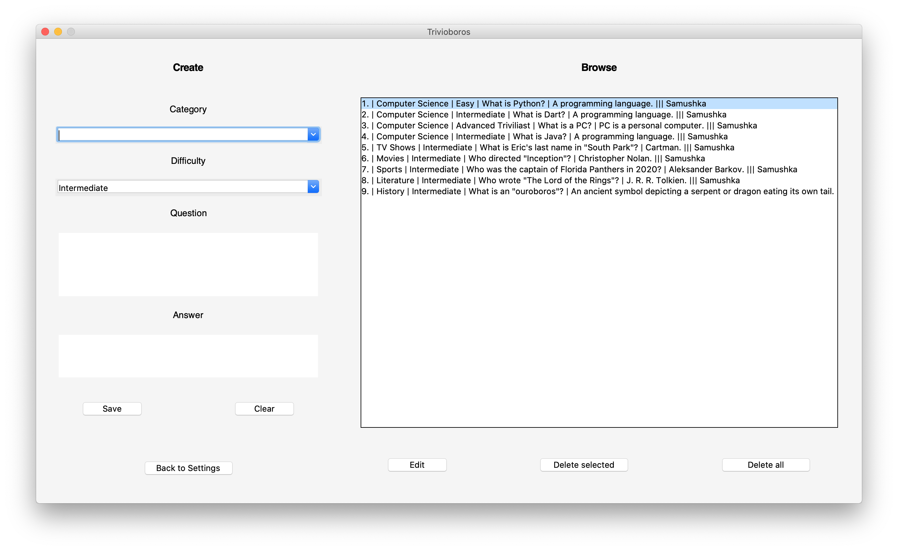
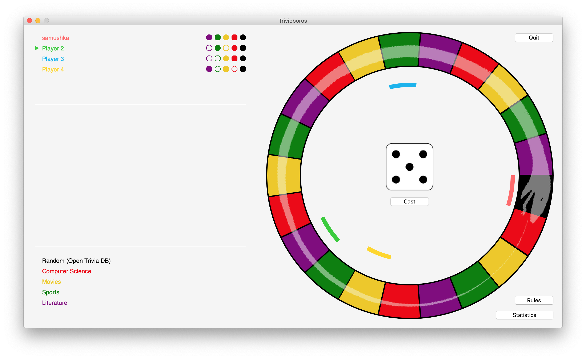

# Käyttöohje

## Asennus

1. Lataa uusin [release](https://github.com/samushka13/ot-harjoitustyo/releases).

2. Varmista, että koneellasi on asianmukainen [Python](https://www.python.org/)-versio (^3.6) ja [Poetry](https://python-poetry.org/)-versio (^1.1.5 suositeltu).

3. Asenna projektin riippuvuudet komennolla:

       poetry install

4. Konfiguroi tarvittaessa tallennustiedostojen nimet [tämän ohjeen](https://github.com/samushka13/ot-harjoitustyo/blob/master/dokumentaatio/kayttoohje.md#konfigurointi) mukaisesti (valinnainen).

5. Käynnistä sovellus komennolla:

       poetry run invoke start

Mikäli käynnistäessä tulee vastaan virheilmoitus siitä, ettei moduulia [requests](https://pypi.org/project/requests/) löydy, se täytyy käydä asentamassa oheisen linkin ohjeiden mukaisesti tai komennolla "pip3 install requests". Mikäli asennuksen jälkeen sovellusta käynnistäessä tulee uudelleen vastaan sama virheilmoitus, paketin asennus kannattaa tehdä virtuaaliympäristössä, eli komennon "poetry shell" jälkeen.

### Järjestelmävaatimukset

Mikäli pelisessioon valitaan kategoria "Random (Open Trivia DB)", joka hakee tietoja kutsumalla [Open Trivia Database API:a](https://opentdb.com/api_config.php), internet-yhteys on välttämätön. Omilla kategorioilla pelatessa internet-yhteyttä ei tarvita.

### Konfigurointi

Sovellus luo käynnistymisensä yhteydessä tietojen tallennukseen käytettävät tietokantatiedostot automaattisesti projektin juurihakemistoon, jossa esimerkiksi README sijaitsee, mikäli kyseisiä tiedostoja ei vielä ole. Tiedostojen nimiä voi tarvittaessa muokata [konfiguraatiotiedostossa](https://github.com/samushka13/ot-harjoitustyo/blob/master/config.txt), joka sekin löytyy projektin juurihakemistosta.

Nimet on oltava mallia "tiedoston_nimi.db", eli konfiguraatiotiedostossa tulee muokata käytännössä vain yhtäsuuruusmerkkien ja pisteiden välisiä alueita. Mikäli tiedoston nimi on kirjoitettu virheellisesti, sovellus luo tiedoston oletusarvoisella nimellä "trivioboros.db" tai "trivioboros_tests.db" riippuen siitä, kummasta tiedostosta on kyse.

Mikäli sovelluksen käyttöliittymän ikkunat näyttävät pienehköiltä, kannattaa kokeilla näytön resoluution muuttamista. Valitettavasti sovellus ei taivu ikkunan koon muuttamiseen, sillä erityisesti pelinäkymän kohdalla tämä olisi tuottanut huomattavan määrän toteutuksellisia haasteita.

### Käyttöjärjestelmien väliset erot 

Sovelluksen ulkonäkö voi hieman vaihdella käyttöjärjestelmästä riippuen. Parhaan kokemuksen saa macOS-käyttöjärjestelmillä, mutta sovellus toimii toki myös Linuxilla, joskin asteen karkeamman näköisenä. Sovellus saattaa toimia myös Windowsilla, mutta tätä ei ole testattu.

## Sovelluksen käyttäminen

### Kirjautuminen

Sovellus käynnistyy kirjautumisnäkymään, josta pystyy sekä kirjautumaan olemassa olevilla tunnuksilla että luomaan uusia tunnuksia. Käyttäjänimen pituus on oltava vähintään kolme merkkiä. Salasana on vapaaehtoinen.

Painikkeet:

- "Proceed": kirjaa käyttäjän sisään sovellukseen syötetyillä tunnuksilla.
- "Users": näyttää listan tietokannassa olevista rekisteröityneistä käyttäjänimistä.

### Pelin asetukset

Kirjautumisen jälkeen avautuu valikkonäkymä, jossa voi esimerkiksi valita pelin asetukset. Pelin aloittamiseksi vaaditaan vähintään yksi pelaaja ja kaksi kategoriaa sekä internet-yhteys, mikäli [Open Trivia Databasesta](https://opentdb.com/) haettuja kategorioita on valittuna. Tyhjiä tai geneerisiä oletusarvoja ei huomioida, joten esimerkiksi alla oleva peli käynnistyisi neljällä pelaajalla ja viidellä kategorialla. Asetuksista voi säätää myös pelilaudan kokoa. Kokeile rohkeasti erilaisia vaihtoehtoja!

Painikkeet:

- "Logout": kirjaa käyttäjän ulos ja avaa kirjautumisnäkymän.
- "Custom Content": avaa omien kysymysten hallinnointinäkymän.
- "Rules": näyttää pelin säännöt.
- "About Open Trivia DB": näyttää lisätietoja [Open Trivia Databasesta](https://opentdb.com/).
- "Start Game": aloittaa pelin valituilla asetuksilla.

### Omat kysymykset

Omien kysymysten hallintanäkymässä on kaksi osaa. Oikeanpuoleisessa osassa voi luoda omia kysymyksiä täyttämällä vaaditut tiedot. 

Vasemmanpuoleisessa osassa voi puolestaan selata ja muokata jo luotuja kysymyksiä, sekä omia että muiden. Mikäli yksikään rekisteröity käyttäjä ei ole luonut omia kysymyksiä, lista olisi siis tyhjä. Alla olevassa kuvassa kysymyksiä on kuitenkin jo aiemmin luotu. Kullakin rivillä on ilmoitettu kysymyksen id-numero, kategoria, haastavuus, kysymys, vastaus ja kysymyksen lisänneen käyttäjän käyttäjänimi.

Painikkeet:

- "Clear": tyhjentää kenttiin täytetyt tiedot.
- "Save": tallentaa täytetyt tiedot.
- "Back to Settings": sulkee ikkunan ja avaa pelin asetusten näkymän.
- "Edit": avaa valitulle kysymykselle muokkausnäkymän.
- "Delete selected": poistaa käyttäjälle kuuluvat valitut kysymykset.
- "Delete all": poistaa kaikki käyttäjälle kuuluvat kysymykset.

### Pelin kulku

#### Aloitus

Aloitustilassa peli voi näyttää esimerkiksi tältä:

Pelinäkymän osat ovat

- vasemmassa ylälaidassa oleva pistetaulukko,
- vasemmassa keskiosassa oleva kysymys- ja vastaustila,
- vasemmassa alalaidassa oleva kategoriataulukko,
- oikeassa laidassa oleva pelilauta.

Pelin aloittaa pistetaulukossa olevan osoittimen osoittama pelaaja. Peli alkaa noppaa 'heittämällä'.

Painikkeet:

- "Cast": arpoo nopan silmäluvun.
- "Quit": lopettaa pelin ja avaa pelin asetusten näkymän.
- "Rules": näyttää pelin säännöt.
- "Statistics": näyttää pelisession tilastot.

#### Pelivuoron kulku 1/3: Kysymys

Nopan 'heittämisen' jälkeen pelivuorossa oleva pelaaja siirtyy automaattisesti nopan osoittaman silmäluvun verran pelilaudalla. Samalla näkymän vasempaan osaan ilmestyy pelilaudan ruutua vastaavasta kategoriasta haettu kysymys. 

Painikkeet:

- "Show answer": näyttää oikean vastauksen kysymykseen.

#### Pelivuoron kulku 2/3: Vastaus

Kun pelaaja on vastannut kysymykseen ja oikea vastaus on näytetty, näkymään ilmestyy painikkeet, joilla pelaajan vastaus vahvistetaan joko oikeaksi tai vääräksi.

Painikkeet:

- "Player's answer was correct": pelaaja saa oikeasta vastauksesta kategoriapisteen, mikäli tällä ei vielä ole kyseistä pistettä.
- "Player's answer was incorrect": pelaaja menettää väärästä vastauksesta kategoriapisteen, mikäli tällä on jo kyseinen piste.

#### Pelivuoron kulku 3/3: Pisteytys

Tässä tapauksessa pelaaja vastasi oikein, joten tämä sai pisteen kyseiseen kategoriaan. Samalla vuoro päättyy, ja tilanne näyttää seuraavanlaiselta:

#### Pelin eteneminen

Kun peli jatkuu jonkin aikaa, se voi näyttää esimerkiksi alla olevan kuvan kaltaiselta. Kuten vasemmasta ylälaidasta huomataan, pelaajat ovat saaneet jo monia kategoriapisteitä.

#### Pelin päättyminen

Peli päättyy, kun yksi pelaajista pääsee aloitusruutuun tai sen yli kaikkien kategoriapisteiden kera. Esimerkiksi alla olevassa kuvassa pelaaja nimeltä "samushka" on voittanut pelin.

On syytä huomioida, että pelilogiikka toimii sen verran vikkelästi, ettei käyttöliittymä välttämättä ennätä piirtää uutta nopan silmälukua ja pelinappulan sijaintia, mikäli voiton ehdot täyttyvät.

Joka tapauksessa, pelin päätyttyä sovellus ilmoittaa, kuka voitti, ja antaa mahdollisuuden palata pelin asetusten näkymään.
