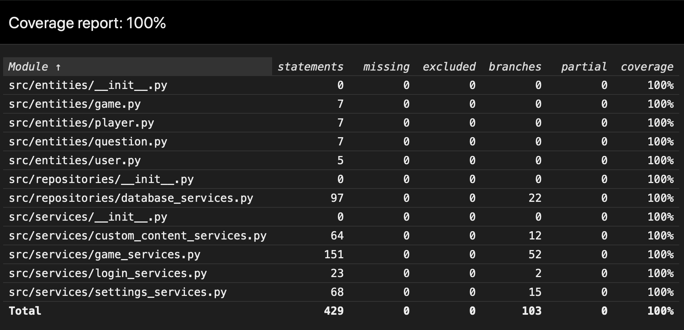

# Testausdokumentti

## Yksikkö- ja integraatiotestaus

Sovelluslogiikkakerroksen palveluluokkien testauksesta vastaa eri testiluokat seuraavasti:

- kirjautumiseen liittyvät palvelut <-> [TestLoginServices](https://github.com/samushka13/ot-harjoitustyo/blob/master/src/tests/login_services_test.py),
- pelin asetuksiin liittyvät palvelut <-> [TestSettingsServices](https://github.com/samushka13/ot-harjoitustyo/blob/master/src/tests/settings_services_test.py),
- omien sisältöjen hallintaan liittyvät palvelut <-> [TestCustomContentServices](https://github.com/samushka13/ot-harjoitustyo/blob/master/src/tests/custom_content_services_test.py),
- pelisessioon liittyvät palvelut <-> [TestGameServices](https://github.com/samushka13/ot-harjoitustyo/blob/master/src/tests/game_services_test.py).

Kaikki testiluokat on alustettu kolmenlaisilla toimenpiteillä:

1. Testitietokannan olennaiset taulut tyhjennetään varmuuden vuoksi.
2. Testattava luokka ja tietojen pysyväistallennuksesta vastaava luokka käynnistetään.
3. Testeissä tarvittavista toistuvista olioista muodostetaan sopivat attribuutit.

Tietojen pysyväistallennuksesta vastaavaa luokkaa *DatabaseServices* ei ole testattu erillisellä luokalla, sillä kaikki sen tarjoamat toiminnallisuudet on testattu edellä mainittujen sovelluslogiikkaluokkien yhteydessä. Tämän ratkaisun ansiosta sekä sovelluslogiikkaa että tietojen pysyväistallennusta on pystytty integraatiotestaamaan realistisesti erilaisissa tilanteissa. Ainoa ero sovelluksen 'todelliseen' toimintaan on, että testauksessa käytetään erinimistä tietokantatiedostoa. Testatessa tuleekin siis varmistaa, että [konfiguraatiotiedostossa](https://github.com/samushka13/ot-harjoitustyo/blob/master/config.txt) tietokantatiedostoilla on eriävät nimet.

## Haarautumakattavuus

Kuten alla olevasta kuvasta näkyy, testien haarautumakattavuus sovelluslogiikan ja tietokantapalveluiden osalta on 100 %. Käyttöliittymästä ja konfiguraatioista vastaavat koodit on jätetty testien ulkopuolelle. 

Vaikka haarautumakattavuus onkin täydellinen, testausta voisi silti parantaa. Esimerkiksi yksittäisen pelivuoron kulkuun liittyviä toimintoja voisi testata erilaisissa tilanteissa vieläkin kattavammin integraatiotestein. Käytännössä tällä ei kuitenkaan saavutettaisi merkittävää hyötyä.

## Järjestelmätestaus

Sovellus on järjestelmätestattu manuaalisesti, eli kaikki [vaatimusmäärittelyn](https://github.com/samushka13/ot-harjoitustyo/blob/master/dokumentaatio/vaatimusmaarittely.md) mukaiset toiminnot on testattu käytännössä erilaisilla syötteillä ja valinnoilla. Testaukseen on myös kuulunut pelin pelaaminen normaalisti useilla erilaisilla asetuksilla kahden käyttäjän toimesta. Testauksen perusteella sovellus osaa ilmoittaa käyttäjälle erilaisista virhetilanteista ja tarjota mahdollisia ratkaisuja.

Käyttöohjeen mukainen asennus ja erilaiset konfiguraatiot on testattu macOS- ja Linux-käyttöjärjestelmissä. Sovellusta on testattu sekä puhtaalta pöydältä uutena käyttäjänä, jolloin sovellus on joutunut luomaan ja alustamaan tietokantatiedostot, että palaavana käyttäjänä, jolloin tietokanta ja sinne tallennetut tiedot ovat olleet valmiina käyttöön.

## Sovellukseen jääneet laatuongelmat

Sovellukseen jäi kolme reunatapausta, joiden yhteydessä sovellus ei toimi toivotulla tavalla. Sovellus ei nimittäin osaa esittää käyttäjälle käyttöliittymän kautta järkevää virheilmoitusta, mikäli

1. internet-yhteys katkeaa kesken pelin, johon on valittu mukaan [Open Trivia Databasesta](https://opentdb.com/api_config.php) haettuja kategorioita,
2. konfiguraatiossa määriteltyihin tiedostoihin ei ole luku- tai kirjoitusoikeuksia,
3. käyttäjä poistaa jonkin sovelluksen käyttämän tiedoston (kuten tietokannan) kesken sovelluksen käytön.
